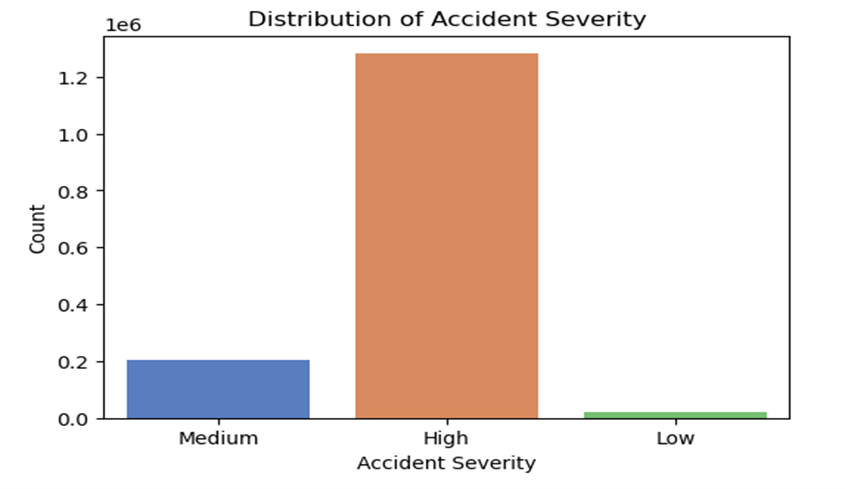

# Visualization and Analysis of United Kingdom Traffic Accidents

## Project Overview

This project focuses on the visualization and analysis of traffic accidents in the United Kingdom, aiming to identify key factors influencing the frequency and severity of these incidents. Utilizing a dataset of 1.8 million traffic accident records from 2005 to 2014, the analysis explores the relationships between accident severity, vehicle involvement, lighting conditions, weather conditions, road surface conditions, and other relevant factors. The insights gained from this project can serve as a foundation for developing systems to improve road safety, reduce accidents, and save lives in the UK.

## Research Question

The primary question guiding this analysis is: **What are the key factors influencing the frequency and severity of traffic accidents in the dataset, and how do these factors vary by time, location, road, and environmental conditions?**

## Data Source

The dataset used for this project was collected from the Kaggle website (Road Accident United Kingdom UK, 2018). [cite_start]It is in `.csv` format and contains 33 features across approximately 1.8 million records. 

## Methodology

The analysis follows a structured methodology comprising the following steps:

1.  **Data Collection:** The data was obtained from Kaggle. 
2.  **Data Cleaning:**
    * Missing values in columns such as Weather Conditions, Road Surface Conditions, Light Conditions, and Accident Severity were handled by removing rows with no data. 
    * Data types of all columns were checked and converted to the proper format (e.g., integer, datetime). 
    * Unique values in Accident Severity, Weather Conditions, Road Surface Conditions, and Light Conditions were verified for consistency. 
    * A summary of traffic accidents per year was generated, noting missing data for 2008. 

    | Year | Accident_Count |
    | :--- | :------------- |
    | 2005 | 198735         |
    | 2006 | 189161         |
    | 2007 | 182115         |
    | 2009 | 163554         |
    | 2010 | 154414         |
    | 2011 | 151474         |
    | 2012 | 179715         |
    | 2013 | 138660         |
    | 2014 | 146322         |

3.  **Preparing the Summary of Data:**
    * Basic descriptive statistics were performed before visualization. 
    * Summary tables based on urban/rural area and accident severity were generated using the `groupby()` function in Python. 

    **Summary of Accidents based on Area:**
    | Urban_or_Rural_Area | Accident_Count |
    | :------------------ | :------------- |
    | 1                   | 972007         |
    | 2                   | 532011         |
    | 3                   | 132            |

    **Summary of Accidents based on Accident Severity:**
    | Accident_Severity | Accident_Count |
    | :---------------- | :------------- |
    | 1                 | 19441          |
    | 2                 | 204504         |
    | 3                 | 1280205        |

4.  **Visualization and Results:**
    * Various visualization techniques were explored, including box plots, heat maps, bar charts, line graphs, and grouped bar charts, to present the data effectively. 
    * The final visualizations emphasize key patterns and interrelations in the data. 

## Key Findings & Visualizations

* **Distribution of Accident Severity:** The majority of accidents fall into "High" and "Medium" severity categories, with "High" severity showing the greatest disparity.

  

* **Accident Severity by Light and Weather Conditions:**
    * Most accidents occur during clear weather, potentially due to heavy traffic or driver overconfidence. 
    * Rainy conditions with strong winds are also significant due to slick roads, which can escalate accident severity. 
    * Accidents in total darkness without street lighting appear less severe, possibly due to less traffic or increased driver caution.

  
    

* **Speed Limit vs. Accident Severity by Road Type:**
    * The rate of injuries increases with speed for all road types. 
    * Single and dual carriageways account for a larger portion of the data, while roundabouts and slip roads have distinct features and speed limitations. 
    * Higher speed limits correlate with increased accident severity.  [cite_start]Accidents at 30 mph tend to be moderate, while those at 70 mph significantly increase the likelihood of severe accidents. 
    * Thoughtful road design, such as roundabouts and slip roads that promote lower speeds, can reduce severity even at higher speed limits.

  
    * *(Include Figure 3: Speed Limit vs Accident Severity by Road Type here or provide a link to the image)*

* **Speed Limits by Road Type:**
    * [cite_start]Safe driving speed zones vary: single carriageways (65-70 kph), dual carriageways (80-90 kph), and roundabouts (30-50 kph). 
    * [cite_start]Slip roads show high accident abundance with speed limits ranging from 65-110 kph. 
    * *(Include Figure 4: Speed Limit by Road Type here or provide a link to the image)*

* **Impact of Speed Limit on Accident Severity:**
    * *(Include Figure 5: Impact of Speed Limit on Accident Severity here or provide a link to the image)*

* **Max and Min Speed Limits by Day of the Week:**
    * [cite_start]The maximum speed limit consistently remains at 70 mph throughout the week, while the minimum speed fluctuates daily. 
    * [cite_start]Day 4 shows a noticeably elevated minimum speed, possibly due to specific road or traffic regulations. 
    * *(Include Figure 6: Max and Min Speed Limits by Day of the Week here or provide a link to the image)*

* **Number of Casualties by Day of the Week:**
    * [cite_start]Day 6 experiences the highest number of casualties, with Day 1 having the lowest.  [cite_start]Other days show comparable casualty numbers, indicating a consistent accident rate. 
    * *(Include Figure 7: Number of Casualties by Day of the Week here or provide a link to the image)*

## Conclusion

[cite_start]This project successfully analyzed the relationship between various predictors and the frequency and severity of traffic crashes in the UK.  [cite_start]The visualizations clearly demonstrate that factors such as weather, visibility, speed limits, and road type significantly influence accident outcomes.  [cite_start]Specifically, adverse weather and poor visibility increase the likelihood of severe injuries, and higher traffic volume tends to correlate with higher speed limits.  [cite_start]These findings highlight the critical need for effective speed regulation and the development of robust infrastructure to mitigate injuries from traffic accidents. 

## How to Run the Project (If Applicable)

*(Add instructions here on how someone can run your code. For example, mention necessary libraries, how to run scripts, etc.)*

**Prerequisites:**
* Python 3.x
* Jupyter Notebook (recommended for running the analysis script)
* Required Python libraries: `pandas`, `numpy`, `matplotlib`, `seaborn` (or any other libraries you used for analysis/visualization)

**Installation:**
```bash
pip install pandas numpy matplotlib seaborn
